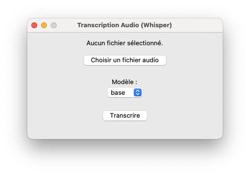
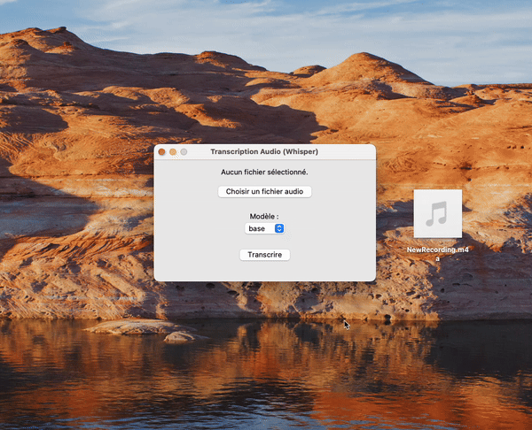
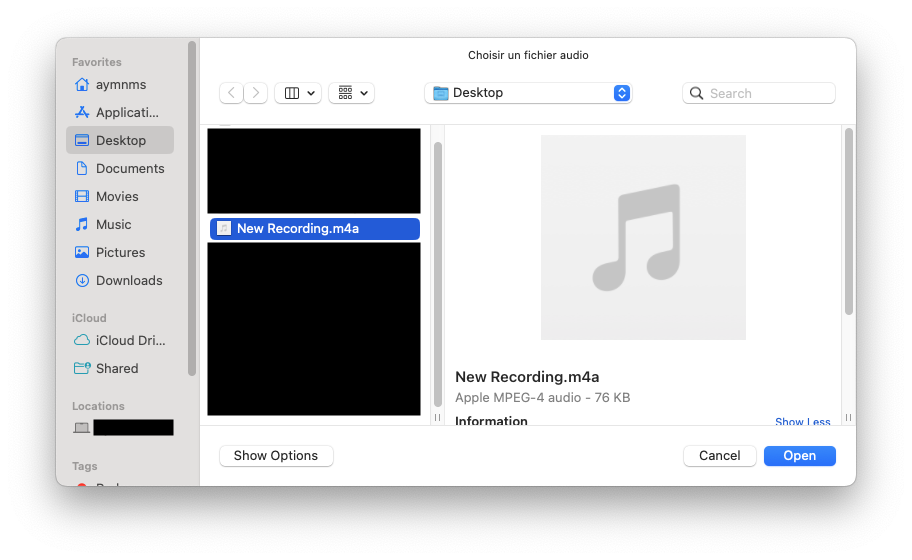
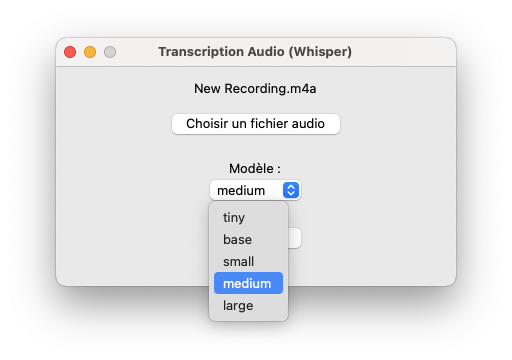
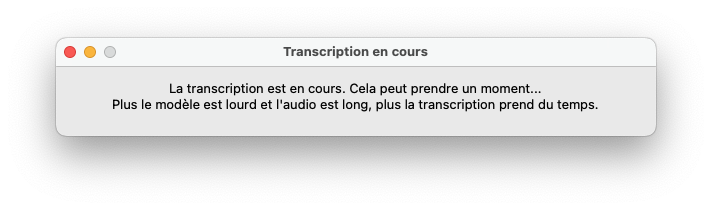
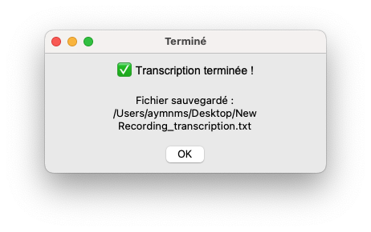
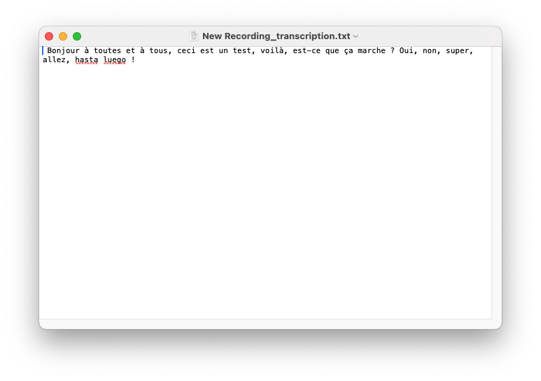
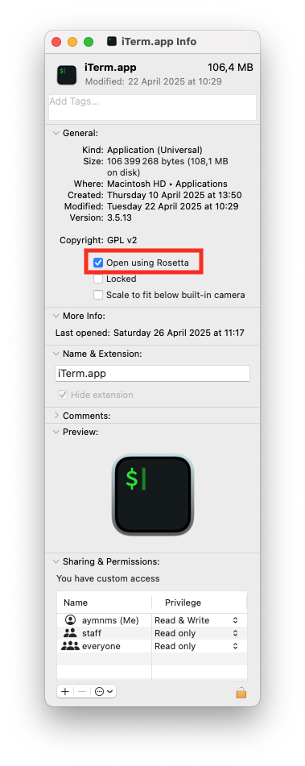

<a id="readme-top"></a>

[![Contributors][contributors-shield]][contributors-url]
[![Forks][forks-shield]][forks-url]
[![Stargazers][stars-shield]][stars-url]
[![Issues][issues-shield]][issues-url]
[![MIT License][license-shield]][license-url]
[![CI][ci-shield]][ci-url]

<br />
<div align="center">
  <a href="https://github.com/aymnms/transcriber">
    
  </a>

  <h3 align="center">transcriber</h3>

  <p align="center">
    A simple, lightweight desktop app that transcribes audio files to text using OpenAI's Whisper — offline, on your own machine.
    <br />
    <a href="https://github.com/aymnms/transcriber/releases"><strong>Download the latest release »</strong></a>
    <br />
    <br />
    <a href="https://github.com/aymnms/transcriber/issues?q=is%3Aissue+is%3Aopen+label%3Abug">Report Bug</a>
    &middot;
    <a href="https://github.com/aymnms/transcriber/issues?q=is%3Aissue+is%3Aopen+label%3Aenhancement">Request Feature</a>
  </p>
</div>

<details>
  <summary>Table of Contents</summary>
  <ol>
    <li><a href="#about-the-project">About The Project</a>
      <ul>
        <li><a href="#built-with">Built With</a></li>
      </ul>
    </li>
    <li><a href="#platform-support">Platform Support</a></li>
    <li><a href="#getting-started">Getting Started</a>
      <ul>
        <li><a href="#prerequisites">Prerequisites</a></li>
        <li><a href="#installation">Installation</a></li>
      </ul>
    </li>
    <li><a href="#usage">Usage</a></li>
    <li><a href="#building-from-source">Building From Source</a>
      <ul>
        <li><a href="#macos-apple-silicon">macOS (Apple Silicon)</a></li>
        <li><a href="#macos-intel">macOS (Intel)</a></li>
        <li><a href="#windows">Windows</a></li>
        <li><a href="#linux">Linux</a></li>
      </ul>
    </li>
    <li><a href="#releases">Releases</a></li>
    <li><a href="#roadmap">Roadmap</a></li>
    <li><a href="#contributing">Contributing</a></li>
    <li><a href="#license">License</a></li>
    <li><a href="#acknowledgments">Acknowledgments</a></li>
  </ol>
</details>

<!-- ABOUT THE PROJECT -->
## About The Project

<div align="center">
  
</div>

**transcriber** is a small Tkinter desktop app for turning audio files into text with [Whisper](https://github.com/openai/whisper), running entirely locally via [faster-whisper](https://github.com/SYSTRAN/faster-whisper) — no audio ever leaves your machine, and no API key or internet connection is required after the model has been downloaded once.

- Pick an audio file (mp3, wav, m4a, and 20+ other formats) through a native file picker
- Choose a Whisper model size (`tiny` → `large`) to trade off speed for accuracy
- Get a plain `.txt` transcription saved next to your audio file

<div align="center">
  
</div>

<p align="right">(<a href="#readme-top">back to top</a>)</p>

### Built With

[![Python][Python-badge]][Python-url]
[![Whisper][Whisper-badge]][Whisper-url]
[![Tkinter][Tkinter-badge]][Tkinter-url]
[![PyInstaller][PyInstaller-badge]][PyInstaller-url]

<p align="right">(<a href="#readme-top">back to top</a>)</p>

<!-- PLATFORM SUPPORT -->
## Platform Support

| OS | Runs | Verified by CI |
|---|---|---|
| macOS (Apple Silicon) | ✅ | ✅ |
| macOS (Intel) | ✅ | ✅ — via Rosetta 2 on a `macos-latest` runner (no `macos-13` runner was ever obtainable from GitHub; see [`AUDIT.md`](./AUDIT.md) for the full story) |
| Windows | ✅ | ✅ |
| Linux | ✅ — requires the `python3-tk` system package, see [Prerequisites](#prerequisites) | ✅ |

Every push is verified end-to-end (including a real transcription) on all four targets — see [`.github/workflows/ci.yml`](./.github/workflows/ci.yml).

<p align="right">(<a href="#readme-top">back to top</a>)</p>

<!-- GETTING STARTED -->
## Getting Started

The fastest way to use transcriber is to grab a pre-built binary for your platform from the [releases page](https://github.com/aymnms/transcriber/releases). The steps below are for running it from source instead.

### Prerequisites

* Python `>=3.10,<3.13`
* Tkinter — bundled with Python on macOS and Windows; on Linux it's a separate **system** package, not installable via `pip`:

  ```bash
  # Debian/Ubuntu
  sudo apt-get install python3-tk

  # Fedora
  sudo dnf install python3-tkinter

  # Arch
  sudo pacman -S tk
  ```

<p align="right">(<a href="#readme-top">back to top</a>)</p>

### Installation

1. Clone the repo
   ```bash
   git clone git@github.com:aymnms/transcriber.git
   cd transcriber
   ```
2. Create a virtual environment and install dependencies
   ```bash
   python3 -m venv .venv
   source .venv/bin/activate
   pip install -r requirements.txt
   ```
3. Run the app
   ```bash
   python3 app_whisper.py
   ```

<p align="right">(<a href="#readme-top">back to top</a>)</p>

<!-- USAGE EXAMPLES -->
## Usage

1. **Pick a file** — click "Choisir un fichier audio" and select the audio file you want transcribed.

   

2. **Pick a model** — larger Whisper models are more accurate but slower; the trade-off also depends on how long your audio is.

   

3. **Wait for it** — closing this window does not interrupt the transcription.

   

4. **Done** — the `.txt` transcription is saved next to your original audio file.

   
   

A short sample audio file is included at [`assets/audios/NewRecording.m4a`](assets/audios/NewRecording.m4a) if you want to try it out immediately.

<p align="right">(<a href="#readme-top">back to top</a>)</p>

<!-- BUILDING FROM SOURCE -->
## Building From Source

Every build below uses [PyInstaller](https://pyinstaller.org/) with `--onedir`, producing a self-contained app folder under `dist/`.

<details>
<summary>Regenerating the macOS <code>.icns</code> icon (only needed if <code>assets/logo.png</code> changes)</summary>

```bash
mkdir MyIcon.iconset
sips -z 16 16     assets/logo.png --out MyIcon.iconset/icon_16x16.png
sips -z 32 32     assets/logo.png --out MyIcon.iconset/icon_16x16@2x.png
sips -z 32 32     assets/logo.png --out MyIcon.iconset/icon_32x32.png
sips -z 64 64     assets/logo.png --out MyIcon.iconset/icon_32x32@2x.png
sips -z 128 128   assets/logo.png --out MyIcon.iconset/icon_128x128.png
sips -z 256 256   assets/logo.png --out MyIcon.iconset/icon_128x128@2x.png
sips -z 256 256   assets/logo.png --out MyIcon.iconset/icon_256x256.png
sips -z 512 512   assets/logo.png --out MyIcon.iconset/icon_256x256@2x.png
sips -z 512 512   assets/logo.png --out MyIcon.iconset/icon_512x512.png
cp assets/logo.png                MyIcon.iconset/icon_512x512@2x.png
iconutil -c icns MyIcon.iconset
```
</details>

### macOS (Apple Silicon)

```bash
pyinstaller --windowed --onedir app_whisper.py --name "Transcriber (ARM)" --icon assets/MyIcon.icns
```

### macOS (Intel)

The Intel build is cross-built from Apple Silicon via Rosetta 2 — the resulting `.app` runs on both Intel and Apple Silicon Macs.

<details>
<summary>Steps</summary>

1. Reopen your terminal with Rosetta enabled (Finder → Applications → Utilities → right-click Terminal → Get Info → check "Open using Rosetta"), or prefix every command below with `arch -x86_64`.

   

2. Create a dedicated x86_64 virtual environment:
   ```bash
   python3 -m venv .venv-intel
   source .venv-intel/bin/activate
   pip install -r requirements.txt
   ```
3. Build:
   ```bash
   arch -x86_64 pyinstaller --windowed --onedir app_whisper.py --name "Transcriber (Intel)" --icon assets/MyIcon.icns
   ```
</details>

### Windows

```bash
pyinstaller --windowed --onedir app_whisper.py --name "Transcriber" --icon assets/logo.ico
```

### Linux

Requires the `python3-tk` system package (see [Prerequisites](#prerequisites)).

```bash
pyinstaller --windowed --onedir app_whisper.py --name "transcriber" --icon assets/logo.png
```

<p align="right">(<a href="#readme-top">back to top</a>)</p>

<!-- RELEASES -->
## Releases

Releases are fully automated with [python-semantic-release](https://python-semantic-release.readthedocs.io/): every push to `main` computes the next version from commit messages, publishes a GitHub Release with an auto-generated [`CHANGELOG.md`](./CHANGELOG.md), and attaches pre-built binaries for all 4 supported platforms.

Commit messages must follow [Conventional Commits](https://www.conventionalcommits.org/):

| Prefix | Effect |
|---|---|
| `feat:` | Minor version bump |
| `fix:`, `perf:` | Patch version bump |
| `feat!:` / `fix!:` / `BREAKING CHANGE:` footer | Major version bump |
| `docs:`, `chore:`, `ci:`, `test:`, `style:`, `refactor:`, `build:` | No release triggered |

<p align="right">(<a href="#readme-top">back to top</a>)</p>

<!-- ROADMAP -->
## Roadmap

- [ ] AppImage packaging for Linux
- [ ] Windows installer (Inno Setup / MSI)
- [ ] macOS codesigning & notarization

See the [open issues](https://github.com/aymnms/transcriber/issues) for a full list of proposed features and known issues, and [`PLAN.md`](./PLAN.md) / [`AUDIT.md`](./AUDIT.md) for the detailed engineering history of the macOS → Windows/Linux migration.

<p align="right">(<a href="#readme-top">back to top</a>)</p>

<!-- CONTRIBUTING -->
## Contributing

Contributions make the open source community amazing — any contribution you make is **greatly appreciated**.

1. Fork the project
2. Create your feature branch (`git checkout -b feat/amazing-feature`)
3. Commit your changes following [Conventional Commits](https://www.conventionalcommits.org/) (`git commit -m 'feat: add amazing feature'`) — this is what drives automated versioning, see [Releases](#releases)
4. Make sure the test suite passes (`pytest tests/unit tests/functional`)
5. Push to your branch (`git push origin feat/amazing-feature`)
6. Open a Pull Request

<p align="right">(<a href="#readme-top">back to top</a>)</p>

<!-- LICENSE -->
## License

Distributed under the MIT License. See [`LICENSE`](./LICENSE) for more information.

<p align="right">(<a href="#readme-top">back to top</a>)</p>

<!-- ACKNOWLEDGMENTS -->
## Acknowledgments

* [OpenAI Whisper](https://github.com/openai/whisper)
* [faster-whisper](https://github.com/SYSTRAN/faster-whisper)
* [PyInstaller](https://pyinstaller.org/)
* [python-semantic-release](https://python-semantic-release.readthedocs.io/)
* [Best-README-Template](https://github.com/othneildrew/Best-README-Template) — this README's structure is based on it

<p align="right">(<a href="#readme-top">back to top</a>)</p>

<!-- MARKDOWN LINKS & IMAGES -->
[contributors-shield]: https://img.shields.io/github/contributors/aymnms/transcriber.svg?style=for-the-badge
[contributors-url]: https://github.com/aymnms/transcriber/graphs/contributors
[forks-shield]: https://img.shields.io/github/forks/aymnms/transcriber.svg?style=for-the-badge
[forks-url]: https://github.com/aymnms/transcriber/network/members
[stars-shield]: https://img.shields.io/github/stars/aymnms/transcriber.svg?style=for-the-badge
[stars-url]: https://github.com/aymnms/transcriber/stargazers
[issues-shield]: https://img.shields.io/github/issues/aymnms/transcriber.svg?style=for-the-badge
[issues-url]: https://github.com/aymnms/transcriber/issues
[license-shield]: https://img.shields.io/github/license/aymnms/transcriber.svg?style=for-the-badge
[license-url]: https://github.com/aymnms/transcriber/blob/main/LICENSE
[ci-shield]: https://img.shields.io/github/actions/workflow/status/aymnms/transcriber/ci.yml?branch=main&style=for-the-badge&label=CI
[ci-url]: https://github.com/aymnms/transcriber/actions/workflows/ci.yml
[Python-badge]: https://img.shields.io/badge/Python-3776AB?style=for-the-badge&logo=python&logoColor=white
[Python-url]: https://www.python.org/
[Whisper-badge]: https://img.shields.io/badge/Whisper-412991?style=for-the-badge&logo=openai&logoColor=white
[Whisper-url]: https://github.com/openai/whisper
[Tkinter-badge]: https://img.shields.io/badge/Tkinter-FFD43B?style=for-the-badge&logo=python&logoColor=blue
[Tkinter-url]: https://docs.python.org/3/library/tkinter.html
[PyInstaller-badge]: https://img.shields.io/badge/PyInstaller-000000?style=for-the-badge
[PyInstaller-url]: https://pyinstaller.org/
