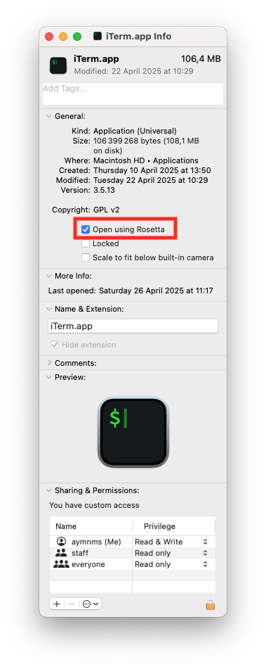

<a id="readme-top"></a>

[![Contributors][contributors-shield]][contributors-url]
[![Forks][forks-shield]][forks-url]
[![Stargazers][stars-shield]][stars-url]
[![Issues][issues-shield]][issues-url]
[![MIT][license-shield]][license-url]


<!-- PROJECT LOGO -->
<br />
<div align="center">
  <a href="https://github.com/aymnms/transcriber">
    
  </a>

<h3 align="center">transcriber</h3>

  <p align="center">
    A simple, lightweight application for transcribing audio files into text with Whisper (OpenAI).
    <br />
    <br />
    <a href="https://github.com/aymnms/transcriber/issues/new?labels=bug&template=bug-report---.md">Report Bug</a>
    &middot;
    <a href="https://github.com/aymnms/transcriber/issues/new?labels=enhancement&template=feature-request---.md">Request Feature</a>
  </p>
</div>


<!-- TABLE OF CONTENTS -->
<details>
  <summary>Table of Contents</summary>
  <ol>
    <li><a href="#about-the-project">About The Project</a></li>
    <ul>
      <li><a href="#download">Download</a></li>
      <li><a href="#usage">Usage</a></li>
      <li><a href="#feature">Feature</a></li>
    </ul>
    <li>
      <a href="#getting-started">Getting Started</a>
      <ul>
        <li><a href="#built-with">Built With</a></li>
        <li><a href="#prerequisites">Prerequisites</a></li>
        <li><a href="#installation">Installation</a></li>
        <li><a href="#generate-app">Generate app</a></li>
        <ul>
          <li><a href="#generate icns">Generate icns</a></li>
          <li><a href="#for-macos-arm">For Macos (ARM)</a></li>
          <li><a href="#for-macos-intel">For Macos (Intel)</a></li>
        </ul>
      </ul>
    </li>
    <li><a href="#license">License</a></li>
  </ol>
</details>


<!-- ABOUT THE PROJECT -->
## About The Project

A simple, lightweight application for transcribing audio files into text with Whisper (OpenAI).

<div align="center">
  <a href="https://github.com/aymnms/transcriber">
    
  </a>
</div>

<p align="right">(<a href="#readme-top">back to top</a>)</p>

### Download

[Download the latest version (.app / .exe)](https://github.com/aymnms/transcriber/releases)

<p align="right">(<a href="#readme-top">back to top</a>)</p>

<!-- USAGE EXAMPLES -->

### Usage

**Main window**


**Select audio**

Clic on "choisir un fichier audio" and select your audio that you want transcribe.


**Select model**

Clic on "Modèle" and select the whisper model that you want to use to transcribe your audio. A 'model' is like a 'version' of an ai. More you use a big version, better the result will be. But it will takes more times. Of course, the duration of the audio has also an impact on the duration of the transcription.


**Wait the moment**

PS: close this window don't stop the transcription.


**Done!**

This window indicate the transcription is done! You can find a txt file content the transcription at the indicate location.


**Transcription content**


**Audio test**


<p align="right">(<a href="#readme-top">back to top</a>)</p>

### Features

- Simple graphical interface with Tkinter
- Support for a wide range of audio formats
- Transcription with Whisper templates (from tiny to large)
- Runs on macOS and Windows

<p align="right">(<a href="#readme-top">back to top</a>)</p>

<!-- GETTING STARTED -->
## Getting Started

### Built With

* [faster-whisper](https://github.com/SYSTRAN/faster-whisper)
* [![Python][Python]][Python-url]  (prerequisites)
* [pyinstaller](https://pyinstaller.org/en/stable/)
* [Tkinter](https://docs.python.org/3/library/tkinter.html) (prerequisites)

<p align="right">(<a href="#readme-top">back to top</a>)</p>

### Prerequisites

Need to install Python and Tkinter.

<p align="right">(<a href="#readme-top">back to top</a>)</p>

### Installation

1. Clone the project

```bash
git clone git@github.com:aymnms/transcriber.git
```

2. Install pip dependences

```bash
cd transcriber
source .venv/bin/activate
pip install -r requirements.txt
```

3. Run the program

```bash
python3 app_whisper.py
```

<p align="right">(<a href="#readme-top">back to top</a>)</p>


### Generate app

#### Generate icns

```bash
mkdir MyIcon.iconset
sips -z 16 16     assets/logo.png --out MyIcon.iconset/icon_16x16.png
sips -z 32 32     assets/logo.png --out MyIcon.iconset/icon_16x16@2x.png
sips -z 32 32     assets/logo.png --out MyIcon.iconset/icon_32x32.png
sips -z 64 64     assets/logo.png --out MyIcon.iconset/icon_32x32@2x.png
sips -z 128 128   assets/logo.png --out MyIcon.iconset/icon_128x128.png
sips -z 256 256   assets/logo.png --out MyIcon.iconset/icon_128x128@2x.png
sips -z 256 256   assets/logo.png --out MyIcon.iconset/icon_256x256.png
sips -z 512 512   assets/logo.png --out MyIcon.iconset/icon_256x256@2x.png
sips -z 512 512   assets/logo.png --out MyIcon.iconset/icon_512x512.png
cp assets/logo.png                MyIcon.iconset/icon_512x512@2x.png
iconutil -c icns MyIcon.iconset
```

<p align="right">(<a href="#readme-top">back to top</a>)</p>

#### For Macos (ARM)

> Only on Mac ARM
> Generate into a dist folder
```bash
pyinstaller --windowed --onedir app_whisper.py --name "Transcriber (ARM)" --icon assets/MyIcon.icns
```

<p align="right">(<a href="#readme-top">back to top</a>)</p>

#### For Macos (Intel)

> This version can be readable on macos intel AND macos arm.
> Generate into a dist folder
```bash
arch -x86_64 pyinstaller --windowed --onedir app_whisper.py --name "Transcriber  (Intel)" --icon assets/MyIcon.icns
```

⚠️ On Mac ARM, if you want to generate an app for Mac Intel, you need to reinstall the project with Rosetta to virtualise an Intel architecture.

1. Quit your terminal and reopen it with Rosetta



2. Recreate a venv only for intel version
```bash
python3 -m venv .venv-intel
```

3. Use this venv
```bash
source .venv-intel/bin/activate
```
4. Install pip dependence (with arch environment, for intel)
```bash
pip install -r requirements.txt
```

5. Generate a .app for Intel (from Mac ARM to Mac Intel also compatible with Mac ARM)
```bash
arch -x86_64 pyinstaller --windowed --onedir app_whisper.py --name "Transcriber (Intel)" --icon assets/MyIcon.icns
```
<p align="right">(<a href="#readme-top">back to top</a>)</p>

<!-- LICENSE -->
## License

Distributed under the MIT. See `LICENSE` for more information.

<p align="right">(<a href="#readme-top">back to top</a>)</p>


<!-- MARKDOWN LINKS & IMAGES -->
<!-- https://www.markdownguide.org/basic-syntax/#reference-style-links -->
[contributors-shield]: https://img.shields.io/github/contributors/aymnms/transcriber.svg?style=for-the-badge
[contributors-url]: https://github.com/aymnms/transcriber/graphs/contributors
[forks-shield]: https://img.shields.io/github/forks/aymnms/transcriber.svg?style=for-the-badge
[forks-url]: https://github.com/aymnms/transcriber/network/members
[stars-shield]: https://img.shields.io/github/stars/aymnms/transcriber.svg?style=for-the-badge
[stars-url]: https://github.com/aymnms/transcriber/stargazers
[issues-shield]: https://img.shields.io/github/issues/aymnms/transcriber.svg?style=for-the-badge
[issues-url]: https://github.com/aymnms/transcriber/issues
[license-shield]: https://img.shields.io/github/license/aymnms/transcriber.svg?style=for-the-badge
[license-url]: https://github.com/aymnms/transcriber/blob/master/LICENSE
[Python]: https://img.shields.io/badge/Python-3776AB?style=for-the-badge&logo=python&logoColor=white
[Python-url]: https://www.python.org/
