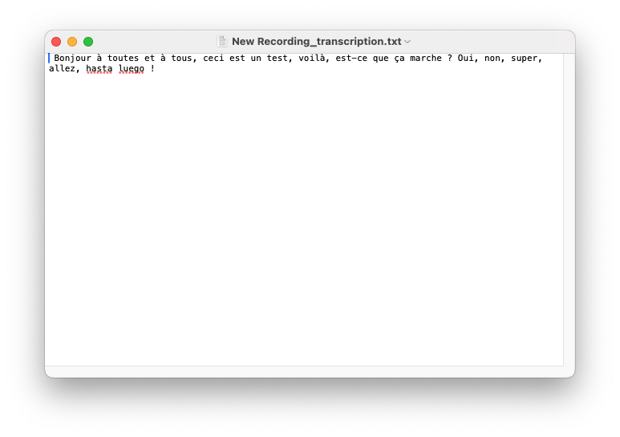

<!-- Improved compatibility of back to top link: See: https://github.com/othneildrew/Best-README-Template/pull/73 -->
<a id="readme-top"></a>
<!--
*** Thanks for checking out the Best-README-Template. If you have a suggestion
*** that would make this better, please fork the repo and create a pull request
*** or simply open an issue with the tag "enhancement".
*** Don't forget to give the project a star!
*** Thanks again! Now go create something AMAZING! :D
-->


<!-- PROJECT SHIELDS -->
<!--
*** I'm using markdown "reference style" links for readability.
*** Reference links are enclosed in brackets [ ] instead of parentheses ( ).
*** See the bottom of this document for the declaration of the reference variables
*** for contributors-url, forks-url, etc. This is an optional, concise syntax you may use.
*** https://www.markdownguide.org/basic-syntax/#reference-style-links
-->
[![Contributors][contributors-shield]][contributors-url]
[![Forks][forks-shield]][forks-url]
[![Stargazers][stars-shield]][stars-url]
[![Issues][issues-shield]][issues-url]
[![MIT][license-shield]][license-url]


<!-- PROJECT LOGO -->
<br />
<div align="center">
  <a href="https://github.com/aymnms/transcriber">
    
  </a>

<h3 align="center">transcriber</h3>

  <p align="center">
    A simple, lightweight application for transcribing audio files into text with Whisper (OpenAI).
    <br />
    <a href="https://github.com/aymnms/transcriber"><strong>Explore the docs »</strong></a>
    <br />
    <br />
    <a href="https://github.com/aymnms/transcriber">View Demo</a>
    &middot;
    <a href="https://github.com/aymnms/transcriber/issues/new?labels=bug&template=bug-report---.md">Report Bug</a>
    &middot;
    <a href="https://github.com/aymnms/transcriber/issues/new?labels=enhancement&template=feature-request---.md">Request Feature</a>
  </p>
</div>


<!-- TABLE OF CONTENTS -->
<details>
  <summary>Table of Contents</summary>
  <ol>
    <li>
      <a href="#about-the-project">About The Project</a>
      <ul>
        <li><a href="#built-with">Built With</a></li>
      </ul>
    </li>
    <li>
      <a href="#download">Download last version</a>
    </li>
    <li>
      <a href="#getting-started">Getting Started</a>
      <ul>
        <li><a href="#prerequisites">Prerequisites</a></li>
        <li><a href="#installation">Installation</a></li>
      </ul>
    </li>
    <li><a href="#usage">Usage</a></li>
    <li><a href="#license">License</a></li>
  </ol>
</details>


<!-- ABOUT THE PROJECT -->
## About The Project

A simple, lightweight application for transcribing audio files into text with Whisper (OpenAI).


### Features

- Simple graphical interface with Tkinter
- Support for a wide range of audio formats
- Transcription with Whisper templates (from tiny to large)
- Runs on macOS and Windows


### Built With

* [faster-whisper](https://github.com/SYSTRAN/faster-whisper)
* [![Python][Python]][Python-url]  (prerequisites)
* [pyinstaller](https://pyinstaller.org/en/stable/)
* [Tkinter](https://docs.python.org/3/library/tkinter.html) (prerequisites)

<p align="right">(<a href="#readme-top">back to top</a>)</p>


## Download

👉 [Download the latest version (.app / .exe)](https://github.com/aymnms/transcriber/releases)

<!-- GETTING STARTED -->
## Getting Started

### Prerequisites

Need to install Python and Tkinter.

### Installation

1. Clone the project

```bash
git clone git@github.com:aymnms/transcriber.git
```

2. Install pip dependences

```bash
cd transcriber
source .venv/bin/activate
pip install -r requirements.txt
```

3. Run the program

```bash
python3 app_whisper.py
```

<p align="right">(<a href="#readme-top">back to top</a>)</p>


### Generate app

#### Macos

> Generate into a dist folder
```bash
pyinstaller --windowed --onedir app_whisper.py --name "Transcriber" --icon assets/MyIcon.icns
```

##### Generate icns

```bash
mkdir MyIcon.iconset
sips -z 16 16     logo.png --out MyIcon.iconset/icon_16x16.png
sips -z 32 32     logo.png --out MyIcon.iconset/icon_16x16@2x.png
sips -z 32 32     logo.png --out MyIcon.iconset/icon_32x32.png
sips -z 64 64     logo.png --out MyIcon.iconset/icon_32x32@2x.png
sips -z 128 128   logo.png --out MyIcon.iconset/icon_128x128.png
sips -z 256 256   logo.png --out MyIcon.iconset/icon_128x128@2x.png
sips -z 256 256   logo.png --out MyIcon.iconset/icon_256x256.png
sips -z 512 512   logo.png --out MyIcon.iconset/icon_256x256@2x.png
sips -z 512 512   logo.png --out MyIcon.iconset/icon_512x512.png
cp logo.png                MyIcon.iconset/icon_512x512@2x.png
iconutil -c icns MyIcon.iconset
```

<!-- USAGE EXAMPLES -->

## Usage

**Main window**


**Select audio**

Clic on "choisir un fichier audio" and select your audio that you want transcribe.


**Select model**

Clic on "Modèle" and select the whisper model that you want to use to transcribe your audio. A 'model' is like a 'version' of an ai. More you use a big version, better the result will be. But it will takes more times. Of course, the duration of the audio has also an impact on the duration of the transcription.


**Wait the moment**

PS: close this window don't stop the transcription.


**Done!**

This window indicate the transcription is done! You can find a txt file content the transcription at the indicate location.


**Transcription content**



**Audio test**


<p align="right">(<a href="#readme-top">back to top</a>)</p>

<!-- LICENSE -->
## License

Distributed under the MIT. See `LICENSE` for more information.

<p align="right">(<a href="#readme-top">back to top</a>)</p>


<!-- MARKDOWN LINKS & IMAGES -->
<!-- https://www.markdownguide.org/basic-syntax/#reference-style-links -->
[contributors-shield]: https://img.shields.io/github/contributors/aymnms/transcriber.svg?style=for-the-badge
[contributors-url]: https://github.com/aymnms/transcriber/graphs/contributors
[forks-shield]: https://img.shields.io/github/forks/aymnms/transcriber.svg?style=for-the-badge
[forks-url]: https://github.com/aymnms/transcriber/network/members
[stars-shield]: https://img.shields.io/github/stars/aymnms/transcriber.svg?style=for-the-badge
[stars-url]: https://github.com/aymnms/transcriber/stargazers
[issues-shield]: https://img.shields.io/github/issues/aymnms/transcriber.svg?style=for-the-badge
[issues-url]: https://github.com/aymnms/transcriber/issues
[license-shield]: https://img.shields.io/github/license/aymnms/transcriber.svg?style=for-the-badge
[license-url]: https://github.com/aymnms/transcriber/blob/master/LICENSE
[Python]: https://img.shields.io/badge/Python-3776AB?style=for-the-badge&logo=python&logoColor=white
[Python-url]: https://www.python.org/